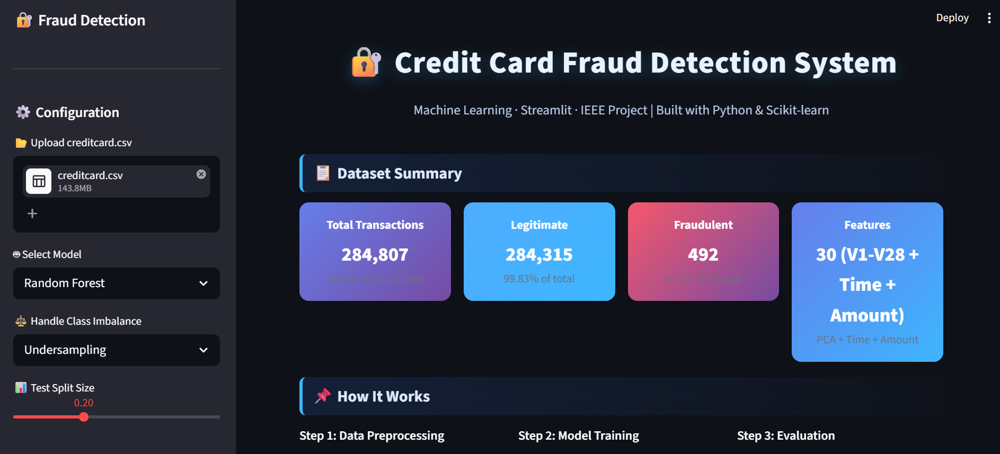

# Credit Card Fraud Detection

A machine learning web application built with Python and Streamlit to detect potentially fraudulent credit card transactions.

## 📌 Project Overview

Credit card fraud detection is a classification problem where machine learning is used to identify fraudulent transactions from legitimate transactions.

This project provides an interactive Streamlit application for exploring the dataset, training machine learning models, evaluating their performance, and predicting whether a transaction is fraudulent.

## 📷 Project Screenshot

The application provides an interactive dashboard for analyzing transactions and detecting fraudulent activity.



## 🛠️ Technologies Used

- Python
- Pandas
- NumPy
- Scikit-learn
- Matplotlib
- Seaborn
- Streamlit

## 🤖 Machine Learning Models

The application includes:

- Logistic Regression
- Random Forest
- Gradient Boosting

The project also handles class imbalance during model training.

## 📊 Dataset

The dataset contains credit card transactions with:

- 284,807 transactions
- 492 fraudulent transactions
- Features including Time, V1–V28, Amount, and Class

The `Class` column represents the transaction type:
- `0` – Legitimate transaction
- `1` – Fraudulent transaction

## 🚀 Features

- Dataset overview
- Data analysis and visualization
- Model training and evaluation
- Fraud prediction for individual transactions
- Interactive Streamlit interface

## ▶️ How to Run

### 1. Clone the repository

```bash
git clone https://github.com/palakgupta2110/Credit-Card-Fraud-Detection.git
cd Credit-Card-Fraud-Detection
